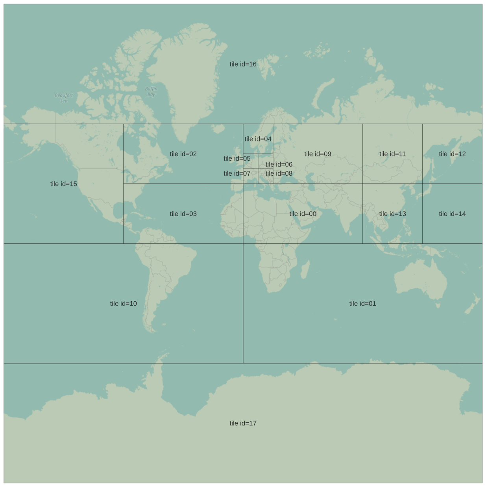

# osm-miniplanets

Size-oriented subdivisions of planet.osm.pbf; customized version of [duodecim](https://github.com/un-vector-tile-toolkit/duodecim)

the following was generated with data from planet-250714

| id | size     |
|----|----------|
| 00 | 8.3 GB   |
| 01 | 6.5 GB   |
| 02 | 8.5 GB   |
| 03 | 7.2 GB   |
| 04 | 2.1 GB   |
| 05 | 6.3 GB   |
| 06 | 4.1 GB   |
| 07 | 5.6 GB   |
| 08 | 3.5 GB   |
| 09 | 6.8 GB   |
| 10 | 3.4 GB   |
| 11 | 459.4 MB |
| 12 | 353.6 MB |
| 13 | 5.0 GB   |
| 14 | 1.5 GB   |
| 15 | 8.7 GB   |
| 16 | 1.3 GB   |
| 17 | 21.8 MB  |
