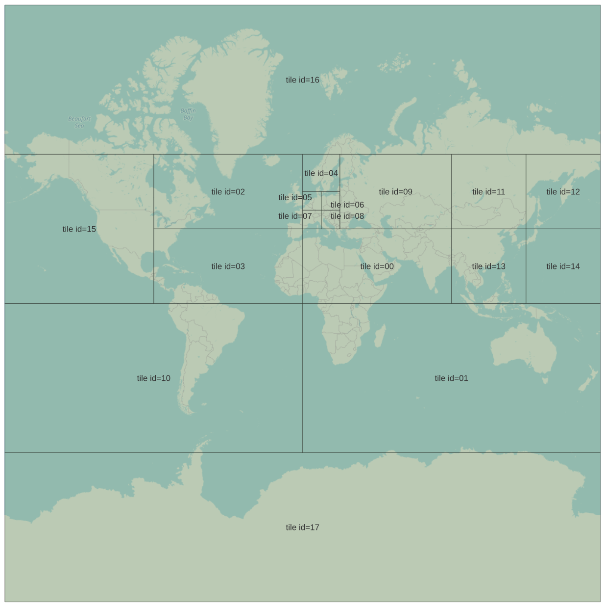

# osm-miniplanets

Size-oriented subdivisions of planet.osm.pbf; customized version of [duodecim](https://github.com/un-vector-tile-toolkit/duodecim)



the following was generated with data from planet-250714

| id | size     |
|----|----------|
| 00 | 8.3 GB   |
| 01 | 6.5 GB   |
| 02 | 8.5 GB   |
| 03 | 7.2 GB   |
| 04 | 2.1 GB   |
| 05 | 6.3 GB   |
| 06 | 4.1 GB   |
| 07 | 5.6 GB   |
| 08 | 3.5 GB   |
| 09 | 6.8 GB   |
| 10 | 3.4 GB   |
| 11 | 459.4 MB |
| 12 | 353.6 MB |
| 13 | 5.0 GB   |
| 14 | 1.5 GB   |
| 15 | 8.7 GB   |
| 16 | 1.3 GB   |
| 17 | 21.8 MB  |

## Installation

```bash
npm install @geolonia/osm-miniplanets
```

## Usage

### tileToMiniplanetId

Returns the miniplanet ID for a given tile coordinate. Returns `undefined` for zoom levels below `BASE_ZOOM` (6).

```typescript
import { tileToMiniplanetId } from '@geolonia/osm-miniplanets';

// Pass tile coordinates as [x, y, z]
const id = tileToMiniplanetId([906, 404, 10]);
console.log(id); // '14'

// Returns undefined for zoom levels below BASE_ZOOM (6)
const id2 = tileToMiniplanetId([0, 0, 5]);
console.log(id2); // undefined
```

### generateGeoJSON

Generates a GeoJSON FeatureCollection containing all miniplanet subdivision boundaries.

```typescript
import { generateGeoJSON } from '@geolonia/osm-miniplanets';

const geojson = generateGeoJSON();
console.log(geojson.features.length); // 18
```

### calculateMiniplanetTiles

Returns the tiles that make up each miniplanet, merged into the largest possible tiles.

```typescript
import { calculateMiniplanetTiles } from '@geolonia/osm-miniplanets';

const tiles = calculateMiniplanetTiles();
// tiles[0] = tiles for miniplanet 00
// tiles[1] = tiles for miniplanet 01
// ...
```

### Constants

```typescript
import { BASE_ZOOM, SUBDIVISIONS } from '@geolonia/osm-miniplanets';

console.log(BASE_ZOOM); // 6
console.log(SUBDIVISIONS.length); // 18
```
